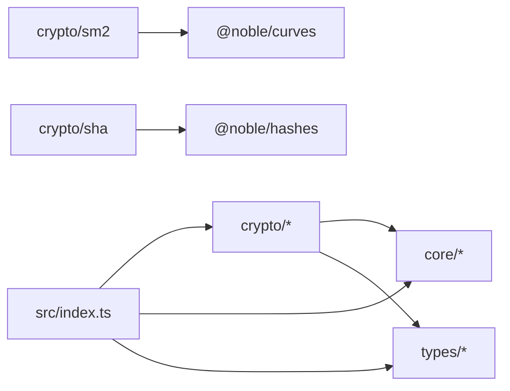

# Monorepo 架构与模块边界

GMKit 在同一仓库维护 TypeScript、Java、文档和 Studio 应用。两个语言实现共享协议向量和发布规则，但各自拥有独立的公共 API、依赖和发布产物。本页说明当前代码结构和依赖方向，不把规划中的能力描述成现有功能。

## 仓库结构

```text
gmkit/
├── packages/
│   ├── ts/                 # npm 包 gmkitx
│   ├── java/               # Maven 多模块工程
├── docs/
│   ├── site/               # VuePress 全项目文档门户与可执行示例
│   └── API_STABILITY.md    # 项目级 API 稳定性策略
├── apps/
│   └── gmkit-studio/       # GMKit Studio V5 Vue3 工具站
├── vectors/                # Java/TypeScript 共享互操作数据
├── scripts/                # 仓库级验证和 native 构建脚本
├── .github/workflows/      # CI、parity、文档和发布工作流
├── package.json            # npm workspace 与统一命令
└── package-lock.json       # workspace 唯一依赖锁文件
```

`packages/ts` 和 `packages/java` 是可发布算法实现；`docs/site`、`apps/gmkit-studio` 和仓库脚本不进入 npm 或 Maven 主包。根级 `vectors` 是测试协议，不是运行时依赖。

## TypeScript 包

```text
packages/ts/
├── src/
│   ├── crypto/
│   │   ├── sm2/            # 加解密、签名、密钥交换和公钥格式
│   │   ├── sm3/            # 摘要、HMAC 和增量状态
│   │   ├── sm4/            # 分组模式与 GCM/CCM
│   │   ├── zuc/            # ZUC-128、EEA3 和 EIA3
│   │   └── sha/            # SHA/HMAC 适配
│   ├── core/               # 编码、随机源和 ASN.1 工具
│   ├── types/              # 公共常量与类型
│   └── index.ts            # 唯一包入口
├── test/                   # 单测、标准向量、负向和互操作测试
├── bench/                  # Vitest benchmark 场景
└── dist/                   # ESM、CJS、IIFE 和类型声明
```

### 依赖方向



- `src/index.ts` 决定 npm 公共导出面。业务代码不应导入未由包 `exports` 开放的内部路径。
- 算法层可以依赖 `core` 和 `types`；公共工具层不得反向依赖算法模块。
- SM2 曲线运算委托给 `@noble/curves`，SHA/HMAC-SHA 委托给 `@noble/hashes`；SM3、SM4 和 ZUC 主流程位于本仓库。发布构建把 noble 代码内联到 ESM/CJS/IIFE，并随包附带 MIT 声明，因此消费者不再承担 noble 的 Node engine 和类型依赖。
- 每个算法同时提供函数式入口和类入口，但两者必须共享实现和错误语义，不能形成两套算法代码。

### 一次调用的处理链

1. 顶层具名导出或算法命名空间接收调用。
2. `core/utils.ts` 按显式格式解析文本、hex、base64 或字节输入。
3. 算法模块校验 key、IV/nonce、模式、长度和格式参数。
4. 核心算法只处理确定的字节语义。
5. 返回值按 `OutputFormat` 编码；AEAD 使用结构化的 `ciphertext` 与 `tag`。

文本解密和二进制解密有意分开。`sm2DecryptBytes`、`sm4DecryptBytes`、`zucDecryptBytes` 不经过 UTF-8，避免任意字节被不可逆替换。

## Java 工程

| 模块 | 发布边界 |
|:--|:--|
| `gmkit` | SM2、SM3、SM4、ZUC 和组合工具的 Java 主包 |
| `gmkit-bom` | Maven 依赖版本对齐 |
| `gmkit-sm9` | SM9 Java API、JNI 桥接与五个平台 runtime；运行时只加载当前平台 |
| `gmkit-benchmarks` | JMH 基准，不是业务运行时依赖 |

Java 主包基于 Bouncy Castle `jdk15to18` 产物族并保持 Java 8 字节码/API 基线。SM9 必须由专门的 native CI 矩阵构建和强制测试；普通 Java 测试允许在没有 GmSSL/JNI 时跳过 native 用例。

## 跨语言边界

Java 和 TypeScript 不共享源码，也不承诺类名、参数对象或 ABI 相同。两端只在明确的协议字段上对齐：

| 算法 | 共享协议字段 |
|:--|:--|
| SM2 | userId、C1 排列、公钥表示、raw/DER、输入输出编码 |
| SM3 | 原始字节、UTF-8 约定和摘要编码 |
| SM4 | mode、padding、IV/nonce、AAD、tag 和 tag 长度 |
| ZUC | key、IV、COUNT、BEARER、DIRECTION 和消息 bit length |

`vectors/interop.json` 由两端测试消费。带标准来源的 case 可作为外部固定向量证据；`project` case 只能证明两端在已固定参数下输出一致，不能用项目自身输出证明算法正确。

## 随机源与兼容层

密钥生成、SM2 加密和 SM2 签名通过统一随机源入口取随机数。默认策略为 `warn`，用于兼容缺少 Web Crypto 的旧小程序：运行时发出一次警告后使用非密码学降级源。安全敏感环境应启用 `configureRNG('strict')`，受限平台应通过 `setCustomRNG()` 注入平台 CSPRNG。

无算法前缀的旧顶层名称仍在 `src/index.ts` 导出并标记 deprecated。兼容层只转发到推荐 API，不维护旧算法分支。SM2 的空 `userId` 同样保留历史回落语义；这类行为属于版本兼容协议，不能在小版本中静默改变。

## 测试分层

| 层级 | 主要证据 | 不能证明的内容 |
|:--|:--|:--|
| 单元与属性测试 | 边界、往返、状态转换、错误输入 | 全部协议组合正确 |
| 外部标准向量 | 指定算法和指定参数的固定结果 | 未覆盖模式或部署安全 |
| Java/TS parity | 共享载荷的跨语言一致性 | API/ABI 相同或独立正确性 |
| 外部语言 fixture | 文档中的固定依赖示例可编译运行 | 外部库全部 API 可互操作 |
| native CI | SM9 runtime 在目标平台可构建并执行 | 未列入矩阵的平台可用 |

发布前命令和 CI 责任见[发布流程](/maintenance/publishing)，算法安全边界见[安全使用指南](/guide/security)。

## 修改规则

1. 新增公开 API 时更新 `src/index.ts`、类型测试、API 清单和 CHANGELOG。
2. 修改确定性算法结果时同时提供外部证据，并运行完整 parity。
3. 修改协议默认值时先判断是否破坏旧调用；兼容行为不能由“标准推荐”直接覆盖。
4. 新增跨语言示例必须有锁定依赖和失败退出的 fixture，并进入 docs CI。
5. 新增 SM9 平台必须补齐聚合 JAR 资源、来源与 SHA-256 清单、native 构建和强制消费测试矩阵。

## 构建产物

TypeScript 发布 ESM、CommonJS、浏览器 IIFE 和 `.d.ts`；Java Central 只发布 parent、BOM、主 JAR 和内置多平台 runtime 的 `gmkit-sm9`。文档站和 Studio 是独立应用，不应成为算法包的隐式运行时依赖。

- [公开 API 清单](/typescript/api-surface)
- [共享互操作向量](/standards/interop-vectors)
- [项目支持范围](/maintenance/reports/support-scope)
